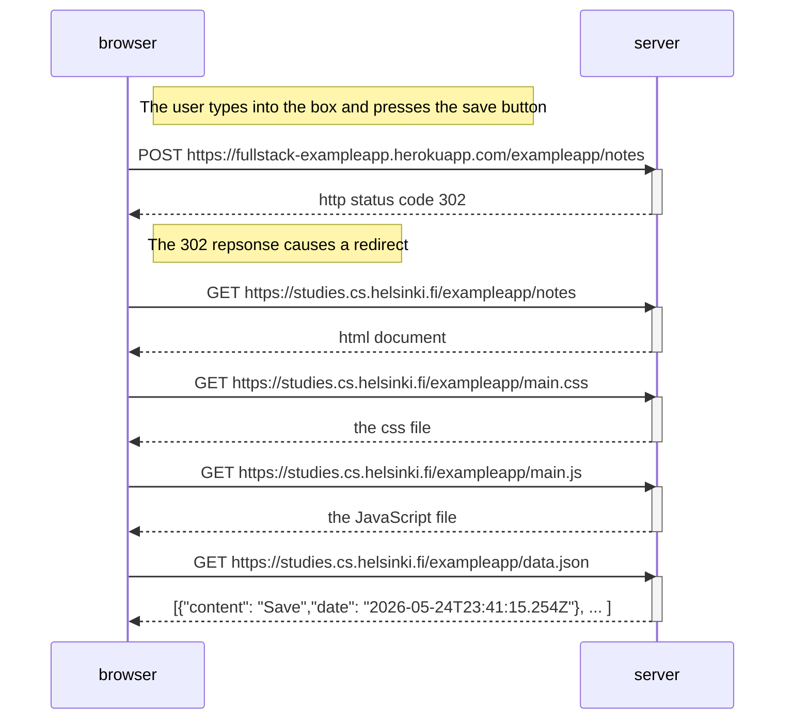

```mermaid
sequenceDiagram
    participant browser
    participant server

    Note right of browser: The user types into the box and presses the save button

    browser->>server: POST https://fullstack-exampleapp.herokuapp.com/exampleapp/notes
    activate server
    server-->>browser: http status code 302
    deactivate server

    Note right of browser: The 302 repsonse causes a redirect

    browser->>server: GET https://studies.cs.helsinki.fi/exampleapp/notes
    activate server
    server-->>browser: html document
    deactivate server

    browser->>server: GET https://studies.cs.helsinki.fi/exampleapp/main.css
    activate server
    server-->>browser: the css file
    deactivate server
    
    browser->>server: GET https://studies.cs.helsinki.fi/exampleapp/main.js
    activate server
    server-->>browser: the JavaScript file
    deactivate server

    browser->>server: GET https://studies.cs.helsinki.fi/exampleapp/data.json
    activate server
    server-->>browser: [{"content": "Save","date": "2026-05-24T23:41:15.254Z"}, ... ]
    deactivate server
```