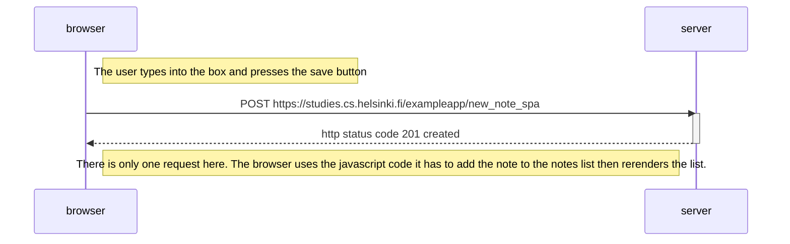

```mermaid
sequenceDiagram
    participant browser
    participant server

    Note right of browser: The user types into the box and presses the save button

    browser->>server: POST https://studies.cs.helsinki.fi/exampleapp/new_note_spa
    activate server
    server-->>browser: http status code 201 created
    deactivate server

    Note right of browser: There is only one request here. The browser uses the javascript code it has to add the note to the notes list then rerenders the list.


```